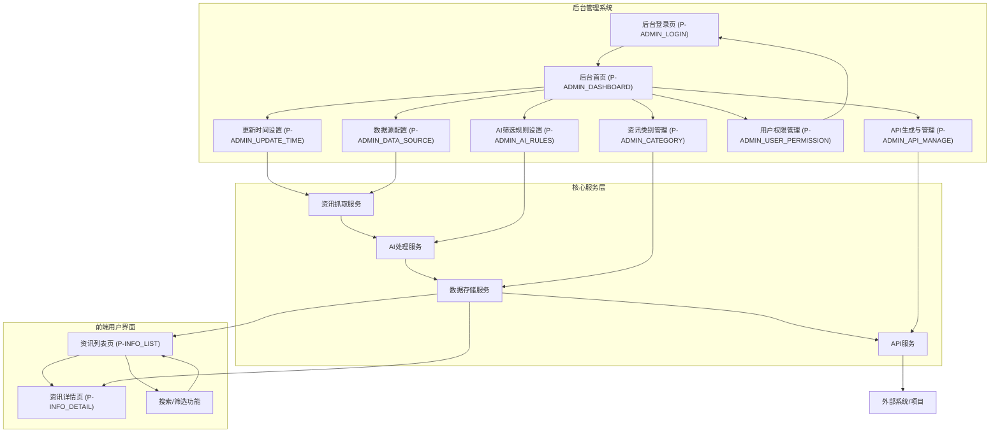
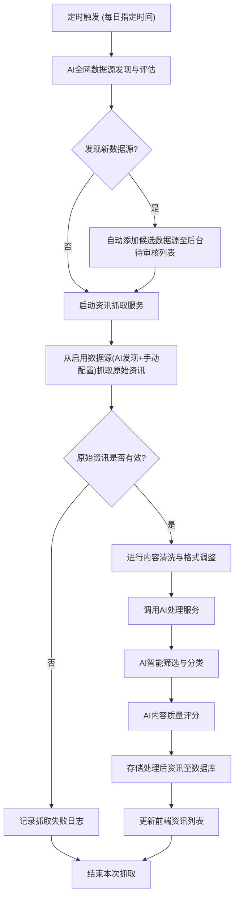
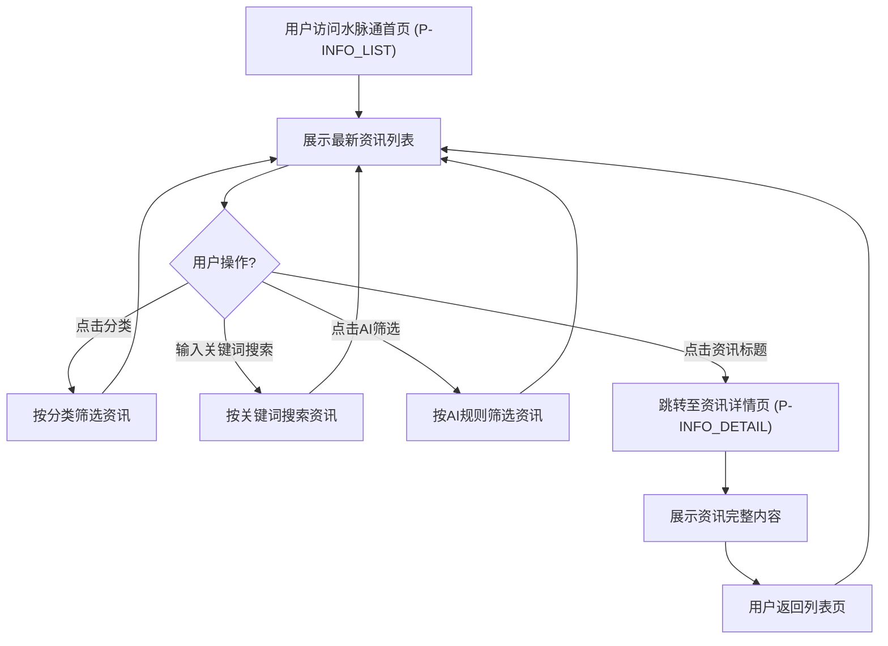
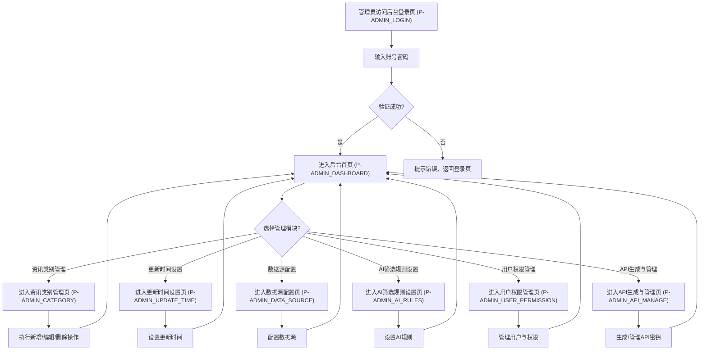
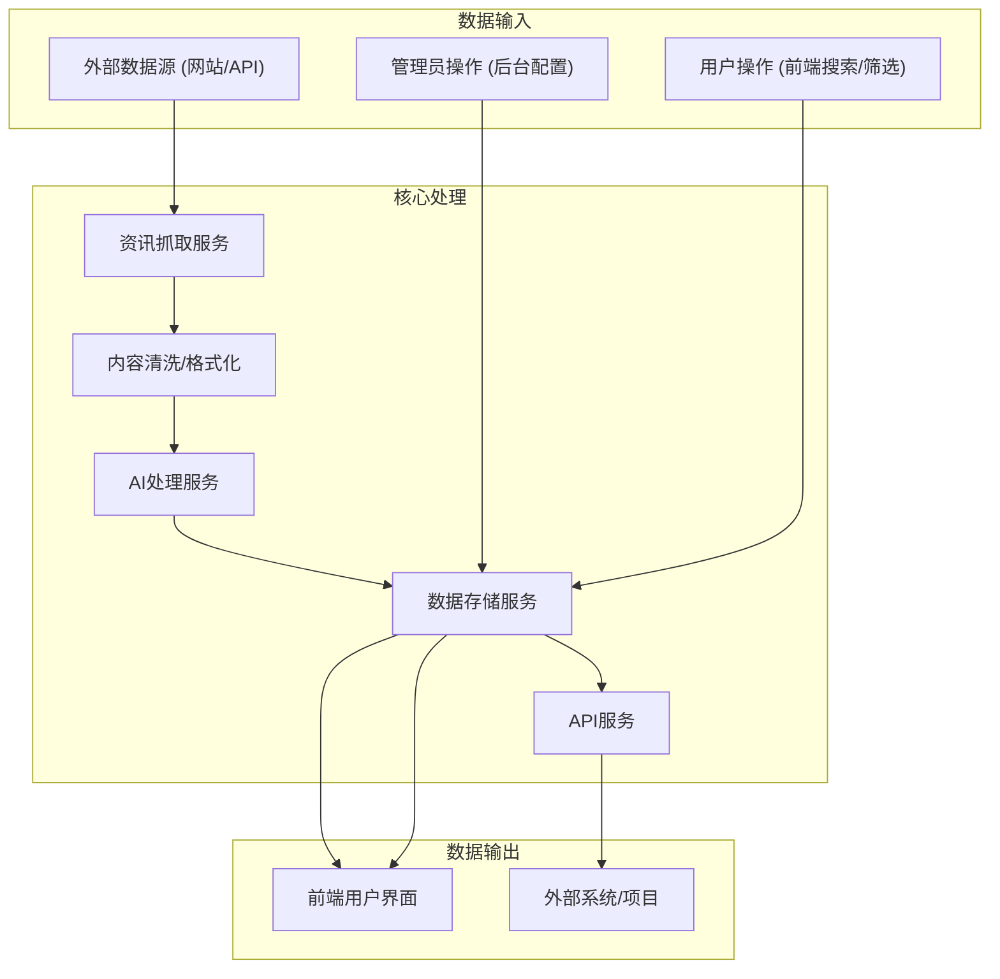

# 水脉通产品需求文档

## 1. 产品概述

### 1.1 产品名称与定位

*   **产品名称:** 水脉通
*   **产品定位:** 一款面向水务行业从业者和政府相关部门人员的Web端信息资讯聚合平台，旨在通过AI技术自动全网获取(包括较强关联度的网站、微信公众号等)并聚合最新、最全、最精准的水务行业资讯，支持AI智能筛选、人工干预及API接口调用。

### 1.2 产品应用语言

*   **产品应用语言:** 简体中文

### 1.3 产品愿景与目标

*   **产品愿景:** 成为水务行业最权威、最智能、最便捷的信息枢纽，赋能行业决策与创新。
*   **产品目标:**
    *   提供每日实时更新的水务行业资讯，确保信息的时效性和全面性。
    *   通过AI智能筛选，提升用户获取精准信息的效率。
    *   构建稳定可靠的后台管理系统，支持资讯类别、更新时间、数据源和AI规则的灵活配置。
    *   提供开放API接口，方便其他项目集成和调用资讯内容。
    *   提升用户满意度，成为水务行业首选的资讯获取平台。

### 1.4 产品使用终端

*   **主要终端:** Web端桌面应用
*   **浏览器支持:** Chrome 90+、Firefox 88+、Safari 14+、Edge 90+
*   **分辨率支持:** 768x480及以上分辨率，最佳体验为1920x1080
*   **响应式适配:** 支持768px以上的所有桌面和平板设备。

### 1.5 核心价值主张

*   **最新最全:** 每日实时更新，聚合全网水务资讯，确保用户获取第一手信息。
*   **AI智能筛选:** 利用AI技术精准筛选、分类和排序资讯，大幅提升信息获取效率。
*   **便捷高效:** 简洁直观的界面设计，支持多维度筛选和快速详情查看。
*   **开放共享:** 提供API接口，促进水务信息的开放共享和行业应用集成。

### 1.6 目标用户群体分析

*   **水务行业从业者:**
    *   **需求:** 及时了解行业政策、技术动态、市场趋势、案例研究等，辅助日常工作和决策。
    *   **痛点:** 信息分散，获取效率低，难以快速找到所需专业内容。
*   **水务单位政府相关部门人员:**
    *   **需求:** 掌握行业政策、法规、标准、重大项目进展、应急事件等，用于政策制定、监管和公共服务。
    *   **痛点:** 信息来源多样，筛选困难，缺乏统一、权威的信息平台。

### 1.7 市场需求与竞品简析

*   **市场需求:** 水务行业对专业化、精准化、实时化的信息需求日益增长，尤其是在政策解读、技术创新、市场分析等方面。现有信息获取渠道分散，效率低下，缺乏智能化的筛选和整合能力。
*   **竞品简析:**
    *   **传统行业媒体/网站:** 信息更新较慢，内容深度有限，缺乏AI智能筛选功能。
    *   **综合新闻聚合平台:** 水务行业内容不够聚焦，专业性不足，无法满足深度需求。
    *   **内部信息系统:** 通常仅限内部使用，不对外开放，且功能单一。
*   **水脉通优势:** 专注于水务行业，结合AI智能筛选和实时更新，提供高度专业化和个性化的信息服务，并支持API开放共享，形成差异化竞争优势。

### 1.8 浏览器兼容性要求

*   **桌面浏览器:**
    *   Google Chrome (最新2个稳定版本)
    *   Mozilla Firefox (最新2个稳定版本)
    *   Microsoft Edge (最新2个稳定版本)
    *   Apple Safari (最新2个稳定版本)
*   **最低分辨率:** 1024x768px
*   **推荐分辨率:** 1920x1080px

## 2. 功能规格

### 2.1 功能详述

#### 2.1.1 资讯信息聚合展示

| 功能ID | 功能名称 | 功能描述 | 优先级 |
|--------|---------|---------|--------|
| F-INFO_AGG_001 | 资讯列表展示 | 在主页面以列表形式展示资讯标题、来源、发布时间、内容摘要、图片缩略图和阅读量。支持按发布时间、阅读量等排序。 | P0 |
| F-INFO_AGG_002 | 资讯详情查看 | 用户点击资讯标题后，跳转至子页面查看完整资讯内容，包括标题、来源、发布时间、作者、全文内容（支持图片、视频等多媒体内容）和阅读量。 | P0 |
| F-INFO_AGG_003 | 分类浏览 | 用户可根据后台设置的资讯类别（如水务政策、技术创新、市场动态等）进行分类浏览。 | P0 |
| F-INFO_AGG_004 | 搜索功能 | 提供关键词搜索框，支持对资讯标题、摘要和全文内容进行模糊搜索。 | P0 |

#### 2.1.2 AI智能筛选

| 功能ID | 功能名称 | 功能描述 | 优先级 |
|--------|---------|---------|--------|
| F-AI_FILTER_001 | 关键词匹配 | 根据用户输入的关键词，AI自动匹配相关度最高的资讯。 | P0 |
| F-AI_FILTER_002 | 相关性排序 | AI根据资讯内容与用户兴趣、历史行为或预设规则的相关性进行排序。 | P0 |
| F-AI_FILTER_003 | 时间范围筛选 | 支持用户选择特定时间范围（如近一天、近一周、近一月）进行资讯筛选。 | P0 |
| F-AI_FILTER_004 | 来源筛选 | 支持用户选择特定资讯来源进行筛选。 | P0 |
| F-AI_FILTER_005 | 内容质量评分 | AI对资讯内容进行质量评估和评分，并可作为筛选条件之一。 | P0 |
| F-AI_FILTER_006 | 主题分类 | AI自动识别资讯主题并进行分类，用户可根据主题进行筛选。 | P0 |

#### 2.1.3 定时自动更新

| 功能ID | 功能名称 | 功能描述 | 优先级 |
|--------|---------|---------|--------|
| F-AUTO_UPDATE_001 | 每日定时更新 | 系统每日在指定时间（可在后台设置）自动从配置的数据源获取最新资讯，并进行处理和更新。 | P0 |
| F-AUTO_UPDATE_002 | 实时更新通知 | 当有新资讯更新时，可在前端页面以通知形式提醒用户。 | P1 |

#### 2.1.4 后台管理系统

| 功能ID | 功能名称 | 功能描述 | 优先级 |
|--------|---------|---------|--------|
| F-ADMIN_001 | 后台登录 | 提供管理员登录入口，验证管理员身份。 | P0 |
| F-ADMIN_002 | 资讯类别管理 | 管理员可新增、编辑、删除资讯类别，并设置类别名称、排序等。 | P0 |
| F-ADMIN_003 | 更新时间设置 | 管理员可设置每日资讯自动更新的具体时间。 | P0 |
| F-ADMIN_004 | 数据源配置 | 系统支持AI自动全网发现并获取较强关联度数据源（网站、微信公众号等），管理员可查看、审核、启用/禁用AI发现的数据源；同时支持手动添加、编辑、删除数据源（如URL、API接口等），并统一管理所有数据源的启用/禁用状态和关联度设置。 | P0 |
| F-ADMIN_005 | AI筛选规则设置 | 管理员可配置AI筛选的关键词库、相关性权重、内容质量评分标准、主题分类规则等。 | P0 |
| F-ADMIN_006 | 用户权限管理 | 管理员可管理后台用户账户，包括新增、编辑、删除用户，以及分配不同的操作权限（如只读、编辑、管理员）。 | P0 |
| F-ADMIN_007 | API生成与管理 | 管理员可生成API密钥，管理API调用权限，并查看API调用日志。 | P0 |

#### 2.1.5 API接口生成

| 功能ID | 功能名称 | 功能描述 | 优先级 |
|--------|---------|---------|--------|
| F-API_001 | API密钥生成 | 管理员可在后台生成唯一的API密钥，用于其他项目调用。 | P0 |
| F-API_002 | API调用权限管理 | 管理员可设置API密钥的调用权限，如允许访问的资讯范围、调用频率限制等。 | P0 |
| F-API_003 | API调用日志 | 记录所有API调用的详细日志，包括调用时间、调用方、请求参数、返回结果等，便于审计和问题排查。 | P1 |

### 2.2 功能模块间的关系图

## 3. 用户流程

### 3.1 用户旅程地图

| 阶段 | 用户目标 | 用户行为 | 系统响应 | 痛点/机遇 |
|------|----------|----------|----------|-----------|
| **发现** | 了解行业动态 | 访问水脉通网站 | 展示最新资讯列表 | 信息分散，难以快速获取 |
| **浏览** | 快速筛选感兴趣内容 | 使用分类、搜索、AI筛选功能 | 实时更新资讯列表，提供精准结果 | 筛选效率低，结果不精准 |
| **深入** | 获取详细信息 | 点击资讯标题 | 跳转至资讯详情页，展示完整内容 | 内容格式混乱，阅读体验差 |
| **管理** | 配置系统参数 | 登录后台，进行类别、时间、数据源、AI规则、用户、API管理 | 后台界面提供相应配置项，实时生效 | 配置复杂，权限管理混乱 |
| **集成** | 调用资讯数据 | 通过API接口获取数据 | API服务返回结构化数据 | 接口不稳定，数据格式不统一 |

### 3.2 关键业务流程图

#### 3.2.1 资讯获取与处理流程

#### 3.2.2 用户浏览资讯流程

#### 3.2.3 管理员后台操作流程

### 3.3 各场景下的用户操作步骤

#### 3.3.1 场景一：用户查找特定水务政策资讯

1.  **用户**：打开浏览器，输入水脉通网址，进入资讯列表页（P-INFO_LIST）。
2.  **系统**：加载并展示最新资讯列表。
3.  **用户**：在页面顶部的搜索框中输入关键词“水务政策”，点击搜索按钮。
4.  **系统**：根据关键词进行AI智能匹配和筛选，实时更新资讯列表，只显示与“水务政策”相关的资讯。
5.  **用户**：浏览筛选后的资讯列表，点击感兴趣的资讯标题。
6.  **系统**：跳转至资讯详情页（P-INFO_DETAIL），展示该资讯的完整内容。
7.  **用户**：阅读资讯内容，可选择返回列表页或继续浏览其他资讯。

#### 3.3.2 场景二：管理员新增资讯类别

1.  **管理员**：打开浏览器，输入水脉通后台登录页（P-ADMIN_LOGIN）。
2.  **系统**：显示登录界面。
3.  **管理员**：输入管理员账号和密码，点击登录按钮。
4.  **系统**：验证成功后，跳转至后台首页（P-ADMIN_DASHBOARD）。
5.  **管理员**：在左侧导航菜单中点击“资讯类别管理”菜单项。
6.  **系统**：跳转至资讯类别管理页（P-ADMIN_CATEGORY），显示现有资讯类别列表。
7.  **管理员**：点击页面上的“新增类别”按钮。
8.  **系统**：弹出新增类别表单。
9.  **管理员**：在表单中输入新类别名称（如“智慧水务”），点击“保存”按钮。
10. **系统**：保存成功后，关闭弹窗，刷新类别列表，显示新增的“智慧水务”类别。

## 4. 数据流设计

### 4.1 数据结构与关系

*   **用户表 (Users)**
    *   `user_id` (PK, UUID)
    *   `username` (VARCHAR, Unique)
    *   `password_hash` (VARCHAR)
    *   `email` (VARCHAR, Unique)
    *   `role` (ENUM: 'admin', 'editor', 'viewer')
    *   `created_at` (DATETIME)
    *   `updated_at` (DATETIME)
*   **资讯类别表 (Categories)**
    *   `category_id` (PK, UUID)
    *   `category_name` (VARCHAR, Unique)
    *   `sort_order` (INT)
    *   `created_at` (DATETIME)
    *   `updated_at` (DATETIME)
*   **数据源表 (DataSources)**
    *   `source_id` (PK, UUID)
    *   `source_name` (VARCHAR)
    *   `source_url` (VARCHAR)
    *   `source_type` (ENUM: 'manual', 'ai_discovered')
    *   `relevance_score` (DECIMAL, 0-100) - AI评估的关联度分数
    *   `discovery_method` (VARCHAR, Nullable) - AI发现的方式/关键词
    *   `enabled` (BOOLEAN)
    *   `created_at` (DATETIME)
    *   `updated_at` (DATETIME)
*   **AI规则表 (AIRules)**
    *   `rule_id` (PK, UUID)
    *   `rule_name` (VARCHAR)
    *   `rule_type` (ENUM: 'keyword', 'correlation', 'quality', 'topic')
    *   `rule_content` (JSON) - 存储具体规则配置
    *   `created_at` (DATETIME)
    *   `updated_at` (DATETIME)
*   **资讯表 (Articles)**
    *   `article_id` (PK, UUID)
    *   `title` (VARCHAR)
    *   `source` (VARCHAR)
    *   `publish_time` (DATETIME)
    *   `author` (VARCHAR, Nullable)
    *   `summary` (TEXT)
    *   `full_content` (LONGTEXT)
    *   `image_urls` (JSON, Array of URLs)
    *   `category_id` (FK, UUID, References Categories)
    *   `ai_quality_score` (DECIMAL, 0-100)
    *   `ai_topics` (JSON, Array of Strings)
    *   `read_count` (INT, Default 0)
    *   `created_at` (DATETIME)
    *   `updated_at` (DATETIME)
*   **API密钥表 (APIKeys)**
    *   `api_key_id` (PK, UUID)
    *   `key_string` (VARCHAR, Unique)
    *   `description` (VARCHAR, Nullable)
    *   `permissions` (JSON) - 存储调用权限配置
    *   `enabled` (BOOLEAN)
    *   `created_by` (FK, UUID, References Users)
    *   `created_at` (DATETIME)
    *   `updated_at` (DATETIME)
*   **API调用日志表 (APILogs)**
    *   `log_id` (PK, UUID)
    *   `api_key_id` (FK, UUID, References APIKeys)
    *   `request_time` (DATETIME)
    *   `request_method` (VARCHAR)
    *   `request_path` (VARCHAR)
    *   `request_params` (JSON)
    *   `response_status` (INT)
    *   `response_time_ms` (INT)
    *   `ip_address` (VARCHAR)

### 4.2 关键数据流向图

### 4.3 数据存储与处理原则

1.  **数据安全性:**
    *   所有敏感数据（如管理员密码）进行加密存储。
    *   API密钥采用高强度随机生成，并进行妥善管理。
    *   数据传输采用HTTPS加密协议。
    *   定期进行数据备份和灾难恢复演练。
2.  **数据一致性:**
    *   采用事务管理确保数据操作的原子性、一致性、隔离性和持久性。
    *   确保资讯抓取、处理、存储和展示各环节数据的一致性。
3.  **数据实时性:**
    *   每日定时抓取与实时更新机制相结合，确保资讯的时效性。
    *   前端展示数据通过高效查询和缓存机制，提供快速响应。
4.  **数据可扩展性:**
    *   数据库设计考虑未来数据量增长，采用分库分表或分布式存储方案。
    *   AI处理服务模块化设计，支持新的AI模型和算法集成。
5.  **数据可审计性:**
    *   记录关键操作日志（如管理员操作、API调用），便于追溯和审计。
    *   资讯来源和处理过程可追溯。

## 5. 页面规格

### 5.1 页面概览

#### 5.1.1 整体布局架构

*   **布局模式:** Web端响应式布局 - 顶部导航栏 + 左侧菜单 + 主内容区。
*   **空间分配策略:**
    *   **顶部导航栏:** 固定高度60px，包含Logo、主要导航链接、搜索框、用户操作区。
    *   **左侧菜单:** 固定宽度200px（展开）/48px（折叠），用于功能模块导航。
    *   **主内容区:** 动态宽度，占据剩余空间，最小宽度不低于720px。
    *   **右侧面板:** **严格限制使用**，仅在屏幕宽度≥1440px且功能确实必要时使用，宽度280-320px，必须在布局中占据独立空间，绝对不能遮挡主内容区，且需确保主内容区宽度≥720px。
*   **导航体系:** 顶部主导航 + 左侧功能菜单 + 面包屑导航（用于多层级页面）。
*   **交互模式:** 页面切换（通过左侧菜单或导航链接）、模态弹窗（用于表单提交、确认操作）、侧边抽屉（用于详情查看）、右键菜单（用于快捷操作）。

#### 5.1.2 页面列表

| 页面ID | 页面名称 | 核心功能 | 布局类型 | 右侧面板 |
|--------|---------|---------|---------|---------|
| P-INFO_LIST | 资讯列表页 | 资讯聚合展示、搜索、筛选、分类浏览 | 二栏布局 | 不使用 |
| P-INFO_DETAIL | 资讯详情页 | 资讯完整内容展示 | 二栏布局 | 不使用 |
| P-ADMIN_LOGIN | 后台登录页 | 管理员身份验证 | 单栏布局 | 不使用 |
| P-ADMIN_DASHBOARD | 后台首页 | 后台管理入口、概览信息 | 二栏布局 | 不使用 |
| P-ADMIN_CATEGORY | 资讯类别管理页 | 资讯类别的增删改查 | 二栏布局 | 不使用 |
| P-ADMIN_UPDATE_TIME | 更新时间设置页 | 设置资讯自动更新时间 | 二栏布局 | 不使用 |
| P-ADMIN_DATA_SOURCE | 数据源配置页 | 数据源的增删改查与启用/禁用 | 二栏布局 | 不使用 |
| P-ADMIN_AI_RULES | AI筛选规则设置页 | AI筛选规则的配置与管理 | 二栏布局 | 不使用 |
| P-ADMIN_USER_PERMISSION | 用户权限管理页 | 后台用户账户及权限管理 | 二栏布局 | 不使用 |
| P-ADMIN_API_MANAGE | API生成与管理页 | API密钥的生成、管理与调用日志查看 | 二栏布局 | 不使用 |

### 5.2 页面详情

#### 5.2.1 资讯列表页（P-INFO_LIST）

**布局架构设计：**
- 页面类型：列表页，核心功能为资讯聚合展示、搜索和筛选。
- 布局模式：二栏布局，顶部导航栏 + 左侧菜单 + 主内容区。
- 空间分配：顶部导航栏固定高度60px，左侧菜单固定宽度200px（展开）/48px（折叠），主内容区占据剩余空间，最小宽度不低于720px。

**页面布局架构：**
- 顶部导航栏：Logo、网站名称、全局搜索框、用户操作区（如登录/注册，若有） - 高度60px，固定定位。
- 左侧菜单：功能导航菜单，当前选中“资讯列表”，支持折叠 - 宽度200px(展开)/48px(折叠)。
- 主内容区域：核心展示区域，最小宽度720px。
  - 页面头部：页面标题“水务资讯”、面包屑导航（如“首页 > 资讯列表”）、主要操作按钮组（如“刷新”） - 高度52px。
  - 工具栏区域：搜索框（关键词）、筛选条件（分类、时间范围、来源、AI质量评分、主题）、排序选项（发布时间、阅读量） - 高度44px，紧凑布局。
  - 内容展示区域：资讯列表，以表格形式展示，包含标题、来源、发布时间、摘要、图片缩略图、阅读量等。支持多选、批量操作（如批量导出） - 自适应高度。
  - 分页区域：分页控件，显示总数、每页条数选择、跳转功能 - 高度40px，右对齐。

**响应式适配策略：**
- 大屏幕(≥1440px)：二栏布局，左侧200px + 主内容区充满剩余空间。
- 中屏幕(1200-1439px)：二栏布局，左侧200px + 主内容区充满剩余空间。
- 小屏幕(768-1199px)：左侧菜单折叠或抽屉式，主内容区充满剩余空间，表格列可折叠或横向滚动。
- 移动端(<768px)：单栏布局，左侧菜单抽屉式，表格转换为卡片式列表或强制横向滚动，保持核心功能。

**组件尺寸规范：**
- 按钮尺寸：主要操作按钮36px高度，次要按钮32px高度。
- 输入框：搜索框36px高度，筛选输入框32px高度。
- 表格行高：36px，支持紧凑和舒适模式。
- 图标尺寸：16-24px。
- 间距规范：组件间距8-16px，区域间距16-24px。

**核心功能：**
资讯列表展示、关键词搜索、多维度筛选（分类、时间、来源、AI质量、主题）、排序、资讯详情查看。

**数据结构：**
| 列名 | 数据类型 | 宽度建议 | 是否可排序 | 操作功能 |
|------|---------|----------|----------|---------|
| 复选框 | 布尔值 | 40px | 否 | 多选 |
| 标题 | 文本+链接 | 400px | 是 | 点击进入详情 |
| 来源 | 文本 | 120px | 是 | 筛选来源 |
| 发布时间 | 日期时间 | 160px | 是 | 时间排序 |
| 摘要 | 文本 | 300px | 否 | 无 |
| 图片 | 图片缩略图 | 80px | 否 | 无 |
| 阅读量 | 数字 | 80px | 是 | 阅读量排序 |
| 操作 | 操作按钮组 | 100px | 否 | 收藏/分享 |

**交互设计：**
- 鼠标交互：表格行悬停高亮，标题链接悬停下划线，筛选条件悬停显示提示。
- 键盘交互：Tab键导航，Enter键确认搜索/筛选，Escape键关闭下拉菜单。
- 状态管理：用户选择的筛选条件、排序方式、分页状态在页面切换后保持。

**页面间跳转关系：**
| 触发组件 | 交互类型 | 目标页面 | 传递参数 | 展示方式 |
|---------|---------|---------|---------|---------|
| 资讯标题 | 点击 | 资讯详情页（P-INFO_DETAIL） | article_id | 页面切换 |
| 分类筛选 | 选择 | 资讯列表页（P-INFO_LIST） | category_id | 主内容区刷新 |
| 时间筛选 | 选择 | 资讯列表页（P-INFO_LIST） | time_range | 主内容区刷新 |
| 来源筛选 | 选择 | 资讯列表页（P-INFO_LIST） | source_id | 主内容区刷新 |
| 关键词搜索 | 输入/点击 | 资讯列表页（P-INFO_LIST） | keyword | 主内容区刷新 |
| 分页控件 | 点击 | 资讯列表页（P-INFO_LIST） | page_num, page_size | 主内容区刷新 |

#### 5.2.2 资讯详情页（P-INFO_DETAIL）

**布局架构设计：**
- 页面类型：详情页，核心功能为展示资讯完整内容。
- 布局模式：二栏布局，顶部导航栏 + 左侧菜单 + 主内容区。
- 空间分配：顶部导航栏固定高度60px，左侧菜单固定宽度200px（展开）/48px（折叠），主内容区占据剩余空间，最小宽度不低于720px。

**页面布局架构：**
- 顶部导航栏：Logo、网站名称、全局搜索框、用户操作区 - 高度60px，固定定位。
- 左侧菜单：功能导航菜单，当前选中“资讯列表”，支持折叠 - 宽度200px(展开)/48px(折叠)。
- 主内容区域：核心展示区域，最小宽度720px。
  - 页面头部：页面标题（资讯标题）、面包屑导航（如“首页 > 资讯列表 > 资讯标题”）、返回按钮 - 高度52px。
  - 资讯元数据区：来源、发布时间、作者、阅读量、所属分类、AI质量评分、AI主题标签 - 高度自适应。
  - 资讯内容区：完整的资讯内容，支持图片、视频等多媒体内容，排版清晰，易于阅读 - 自适应高度。
  - 相关推荐区：根据当前资讯内容推荐相关资讯列表（可选） - 高度自适应。

**响应式适配策略：**
- 大屏幕(≥1440px)：二栏布局，左侧200px + 主内容区充满剩余空间。
- 中屏幕(1200-1439px)：二栏布局，左侧200px + 主内容区充满剩余空间。
- 小屏幕(768-1199px)：左侧菜单折叠或抽屉式，主内容区充满剩余空间，图片等媒体内容自适应宽度。
- 移动端(<768px)：单栏布局，左侧菜单抽屉式，内容单列显示，图片等媒体内容自适应宽度。

**组件尺寸规范：**
- 按钮尺寸：返回按钮32px高度。
- 文本区域：行高1.6-1.8倍字号，字号14-16px。
- 图片：最大宽度不超过主内容区宽度，高度自适应。
- 间距规范：组件间距12-20px，区域间距24-32px。

**核心功能：**
展示资讯完整内容、显示资讯元数据、提供返回列表功能。

**交互设计：**
- 鼠标交互：图片点击可放大查看，链接悬停下划线。
- 键盘交互：Escape键可关闭图片放大视图。
- 状态管理：无特殊状态管理。

**页面间跳转关系：**
| 触发组件 | 交互类型 | 目标页面 | 传递参数 | 展示方式 |
|---------|---------|---------|---------|---------|
| 返回按钮 | 点击 | 资讯列表页（P-INFO_LIST） | 无 | 页面切换 |
| 面包屑导航 | 点击 | 资讯列表页（P-INFO_LIST） | 无 | 页面切换 |
| 相关推荐资讯标题 | 点击 | 资讯详情页（P-INFO_DETAIL） | article_id | 页面切换 |

#### 5.2.3 后台登录页（P-ADMIN_LOGIN）

**布局架构设计：**
- 页面类型：登录页，核心功能为管理员身份验证。
- 布局模式：单栏布局，居中显示登录表单。
- 空间分配：登录表单区域居中，宽度限制在400-500px。

**页面布局架构：**
- 页面主体：居中显示登录框，包含Logo、系统名称、用户名输入框、密码输入框、登录按钮、忘记密码链接（可选）。
- 背景：简洁的背景图或纯色背景。

**响应式适配策略：**
- 大屏幕(≥1440px)：登录框居中，宽度固定。
- 中屏幕(1200-1439px)：登录框居中，宽度固定。
- 小屏幕(768-1199px)：登录框居中，宽度自适应，最大宽度不超过屏幕宽度的80%。
- 移动端(<768px)：登录框全屏或宽度自适应，输入框和按钮高度适应移动端。

**组件尺寸规范：**
- 输入框：40px高度。
- 登录按钮：44px高度，宽度充满表单区域。
- 间距规范：输入框间距16px，按钮与输入框间距24px。

**核心功能：**
管理员账号密码登录。

**交互设计：**
- 鼠标交互：输入框点击聚焦，按钮悬停效果。
- 键盘交互：Tab键切换输入框，Enter键触发登录。
- 状态管理：登录失败时显示错误提示。

**页面间跳转关系：**
| 触发组件 | 交互类型 | 目标页面 | 传递参数 | 展示方式 |
|---------|---------|---------|---------|---------|
| 登录按钮 | 点击 | 后台首页（P-ADMIN_DASHBOARD） | 无 | 页面切换 |

#### 5.2.4 后台首页（P-ADMIN_DASHBOARD）

**布局架构设计：**
- 页面类型：后台管理入口页，提供各管理模块的导航和概览信息。
- 布局模式：二栏布局，顶部导航栏 + 左侧菜单 + 主内容区。
- 空间分配：顶部导航栏固定高度60px，左侧菜单固定宽度200px（展开）/48px（折叠），主内容区占据剩余空间，最小宽度不低于720px。

**页面布局架构：**
- 顶部导航栏：Logo、系统名称、管理员信息、退出登录按钮 - 高度60px，固定定位。
- 左侧菜单：后台功能导航菜单，包含“资讯类别管理”、“更新时间设置”、“数据源配置”、“AI筛选规则设置”、“用户权限管理”、“API生成与管理”等菜单项，当前选中“后台首页”，支持折叠 - 宽度200px(展开)/48px(折叠)。
- 主内容区域：核心展示区域，最小宽度720px。
  - 页面头部：页面标题“后台管理首页”、欢迎信息 - 高度52px。
  - 概览统计区：以卡片形式展示关键统计数据，如资讯总数、今日更新数、API调用次数等（可选） - 自适应高度。
  - 快捷入口区：提供各管理模块的快捷入口按钮或链接 - 自适应高度。

**响应式适配策略：**
- 大屏幕(≥1440px)：二栏布局，左侧200px + 主内容区充满剩余空间。
- 中屏幕(1200-1439px)：二栏布局，左侧200px + 主内容区充满剩余空间。
- 小屏幕(768-1199px)：左侧菜单折叠或抽屉式，主内容区充满剩余空间，卡片布局自适应。
- 移动端(<768px)：单栏布局，左侧菜单抽屉式，卡片单列显示。

**组件尺寸规范：**
- 按钮尺寸：快捷入口按钮36px高度。
- 统计卡片：高度120-160px，宽度自适应。
- 间距规范：卡片间距16px，区域间距24px。

**核心功能：**
后台管理模块导航、系统概览信息展示。

**交互设计：**
- 鼠标交互：左侧菜单项悬停高亮，快捷入口按钮悬停效果。
- 键盘交互：Tab键导航，Enter键激活链接/按钮。
- 状态管理：无特殊状态管理。

**页面间跳转关系：**
| 触发组件 | 交互类型 | 目标页面 | 传递参数 | 展示方式 |
|---------|---------|---------|---------|---------|
| 左侧菜单“资讯类别管理” | 点击 | 资讯类别管理页（P-ADMIN_CATEGORY） | 无 | 页面切换 |
| 左侧菜单“更新时间设置” | 点击 | 更新时间设置页（P-ADMIN_UPDATE_TIME） | 无 | 页面切换 |
| 左侧菜单“数据源配置” | 点击 | 数据源配置页（P-ADMIN_DATA_SOURCE） | 无 | 页面切换 |
| 左侧菜单“AI筛选规则设置” | 点击 | AI筛选规则设置页（P-ADMIN_AI_RULES） | 无 | 页面切换 |
| 左侧菜单“用户权限管理” | 点击 | 用户权限管理页（P-ADMIN_USER_PERMISSION） | 无 | 页面切换 |
| 左侧菜单“API生成与管理” | 点击 | API生成与管理页（P-ADMIN_API_MANAGE） | 无 | 页面切换 |
| 快捷入口按钮 | 点击 | 对应管理页面 | 无 | 页面切换 |
| 退出登录按钮 | 点击 | 后台登录页（P-ADMIN_LOGIN） | 无 | 页面切换 |

#### 5.2.5 资讯类别管理页（P-ADMIN_CATEGORY）

**布局架构设计：**
- 页面类型：列表管理页，核心功能为资讯类别的增删改查。
- 布局模式：二栏布局，顶部导航栏 + 左侧菜单 + 主内容区。
- 空间分配：顶部导航栏固定高度60px，左侧菜单固定宽度200px（展开）/48px（折叠），主内容区占据剩余空间，最小宽度不低于720px。

**页面布局架构：**
- 顶部导航栏：Logo、系统名称、管理员信息、退出登录按钮 - 高度60px，固定定位。
- 左侧菜单：后台功能导航菜单，当前选中“资讯类别管理”，支持折叠 - 宽度200px(展开)/48px(折叠)。
- 主内容区域：核心展示区域，最小宽度720px。
  - 页面头部：页面标题“资讯类别管理”、面包屑导航、主要操作按钮组（如“新增类别”） - 高度52px。
  - 工具栏区域：搜索框（按类别名称搜索） - 高度44px。
  - 内容展示区域：资讯类别列表，以表格形式展示，包含类别名称、排序、创建时间、更新时间、操作（编辑、删除） - 自适应高度。
  - 分页区域：分页控件，显示总数、每页条数选择、跳转功能 - 高度40px，右对齐。

**响应式适配策略：**
- 大屏幕(≥1440px)：二栏布局，左侧200px + 主内容区充满剩余空间。
- 中屏幕(1200-1439px)：二栏布局，左侧200px + 主内容区充满剩余空间。
- 小屏幕(768-1199px)：左侧菜单折叠或抽屉式，主内容区充满剩余空间，表格列可折叠或横向滚动。
- 移动端(<768px)：单栏布局，左侧菜单抽屉式，表格转换为卡片式列表或强制横向滚动。

**组件尺寸规范：**
- 按钮尺寸：新增按钮36px高度，编辑/删除按钮28px高度。
- 输入框：搜索框36px高度。
- 表格行高：36px。
- 间距规范：组件间距8-16px，区域间距16-24px。

**核心功能：**
资讯类别的新增、编辑、删除、搜索、排序。

**数据结构：**
| 列名 | 数据类型 | 宽度建议 | 是否可排序 | 操作功能 |
|------|---------|----------|----------|---------|
| 复选框 | 布尔值 | 40px | 否 | 多选 |
| 类别名称 | 文本 | 200px | 是 | 无 |
| 排序 | 数字 | 80px | 是 | 无 |
| 创建时间 | 日期时间 | 160px | 是 | 无 |
| 更新时间 | 日期时间 | 160px | 是 | 无 |
| 操作 | 操作按钮组 | 120px | 否 | 编辑/删除 |

**交互设计：**
- 鼠标交互：表格行悬停高亮，编辑/删除按钮悬停效果。
- 键盘交互：Tab键导航，Enter键确认搜索。
- 状态管理：用户选择的筛选条件、排序方式、分页状态在页面切换后保持。

**页面间跳转关系：**
| 触发组件 | 交互类型 | 目标页面 | 传递参数 | 展示方式 |
|---------|---------|---------|---------|---------|
| 新增类别按钮 | 点击 | 新增/编辑类别弹窗 | 无 | 模态弹窗 |
| 编辑按钮 | 点击 | 新增/编辑类别弹窗 | category_id | 模态弹窗 |
| 删除按钮 | 点击 | 确认删除弹窗 | category_id | 确认对话框 |

#### 5.2.6 更新时间设置页（P-ADMIN_UPDATE_TIME）

**布局架构设计：**
- 页面类型：表单页，核心功能为设置资讯自动更新时间。
- 布局模式：二栏布局，顶部导航栏 + 左侧菜单 + 主内容区。
- 空间分配：顶部导航栏固定高度60px，左侧菜单固定宽度200px（展开）/48px（折叠），主内容区占据剩余空间，最小宽度不低于720px。

**页面布局架构：**
- 顶部导航栏：Logo、系统名称、管理员信息、退出登录按钮 - 高度60px，固定定位。
- 左侧菜单：后台功能导航菜单，当前选中“更新时间设置”，支持折叠 - 宽度200px(展开)/48px(折叠)。
- 主内容区域：核心展示区域，最小宽度720px。
  - 页面头部：页面标题“更新时间设置”、面包屑导航 - 高度52px。
  - 表单区域：包含时间选择器（用于选择每日更新的具体时间）、保存按钮 - 自适应高度。

**响应式适配策略：**
- 大屏幕(≥1440px)：二栏布局，左侧200px + 主内容区充满剩余空间。
- 中屏幕(1200-1439px)：二栏布局，左侧200px + 主内容区充满剩余空间。
- 小屏幕(768-1199px)：左侧菜单折叠或抽屉式，主内容区充满剩余空间，表单元素宽度自适应。
- 移动端(<768px)：单栏布局，左侧菜单抽屉式，表单元素宽度自适应。

**组件尺寸规范：**
- 时间选择器：40px高度。
- 保存按钮：44px高度。
- 间距规范：表单元素间距16px，按钮与表单间距24px。

**核心功能：**
设置每日资讯自动更新的具体时间。

**交互设计：**
- 鼠标交互：时间选择器点击弹出时间选择面板。
- 键盘交互：Tab键导航，Enter键触发保存。
- 状态管理：保存成功后显示提示信息。

**页面间跳转关系：**
| 触发组件 | 交互类型 | 目标页面 | 传递参数 | 展示方式 |
|---------|---------|---------|---------|---------|
| 保存按钮 | 点击 | 当前页面 | 无 | 页面内刷新/提示 |

#### 5.2.7 数据源配置页（P-ADMIN_DATA_SOURCE）

**布局架构设计：**
- 页面类型：列表管理页，核心功能为AI自动发现数据源的审核、数据源的手动增删改查、启用/禁用及关联度管理。
- 布局模式：二栏布局，顶部导航栏 + 左侧菜单 + 主内容区。
- 空间分配：顶部导航栏固定高度60px，左侧菜单固定宽度200px（展开）/48px（折叠），主内容区占据剩余空间，最小宽度不低于720px。

**页面布局架构：**
- 顶部导航栏：Logo、系统名称、管理员信息、退出登录按钮 - 高度60px，固定定位。
- 左侧菜单：后台功能导航菜单，当前选中“数据源配置”，支持折叠 - 宽度200px(展开)/48px(折叠)。
- 主内容区域：核心展示区域，最小宽度720px。
  - 页面头部：页面标题“数据源配置”、面包屑导航、主要操作按钮组（如“新增数据源”、“AI发现数据源审核”） - 高度52px。
  - 工具栏区域：搜索框（按数据源名称/URL搜索） - 高度44px。
  - 内容展示区域：数据源列表，以表格形式展示，包含数据源名称、URL、启用状态、创建时间、更新时间、操作（编辑、删除、启用/禁用） - 自适应高度。
  - 分页区域：分页控件，显示总数、每页条数选择、跳转功能 - 高度40px，右对齐。

**响应式适配策略：**
- 大屏幕(≥1440px)：二栏布局，左侧200px + 主内容区充满剩余空间。
- 中屏幕(1200-1439px)：二栏布局，左侧200px + 主内容区充满剩余空间。
- 小屏幕(768-1199px)：左侧菜单折叠或抽屉式，主内容区充满剩余空间，表格列可折叠或横向滚动。
- 移动端(<768px)：单栏布局，左侧菜单抽屉式，表格转换为卡片式列表或强制横向滚动。

**组件尺寸规范：**
- 按钮尺寸：新增按钮36px高度，编辑/删除/启用/禁用按钮28px高度。
- 输入框：搜索框36px高度。
- 表格行高：36px。
- 间距规范：组件间距8-16px，区域间距16-24px。

**核心功能：**
- AI发现数据源审核：查看AI自动发现的候选数据源，审核并决定是否启用
- 数据源管理：手动新增、编辑、删除数据源
- 状态管理：启用/禁用数据源
- 关联度管理：查看和调整数据源的关联度分数
- 搜索筛选：按名称、类型、状态、关联度等多维度筛选
数据源的新增、编辑、删除、启用/禁用、搜索。

**数据结构：**
| 列名 | 数据类型 | 宽度建议 | 是否可排序 | 操作功能 |
|------|---------|----------|----------|---------|
| 复选框 | 布尔值 | 40px | 否 | 多选 |
| 数据源名称 | 文本 | 200px | 是 | 无 |
| 数据源类型 | 标签 | 120px | 是 | 筛选类型(AI发现/手动配置) |
| 关联度 | 进度条/数值 | 120px | 是 | 按关联度排序 |
| URL | 文本 | 300px | 否 | 无 |
| 启用状态 | 开关/标签 | 100px | 是 | 切换启用/禁用 |
| 创建时间 | 日期时间 | 160px | 是 | 无 |
| 更新时间 | 日期时间 | 160px | 是 | 无 |
| 操作 | 操作按钮组 | 200px | 否 | 编辑/删除/启用/禁用/调整关联度 |

**交互设计：**
- 鼠标交互：表格行悬停高亮，编辑/删除/启用/禁用按钮悬停效果，开关点击切换状态。
- 键盘交互：Tab键导航，Enter键确认搜索。
- 状态管理：用户选择的筛选条件、排序方式、分页状态在页面切换后保持。

**页面间跳转关系：**
| 触发组件 | 交互类型 | 目标页面 | 传递参数 | 展示方式 |
|---------|---------|---------|---------|---------|
| AI发现数据源审核按钮 | 点击 | AI发现数据源审核弹窗 | 无 | 模态弹窗 |
| 调整关联度按钮 | 点击 | 关联度调整弹窗 | source_id | 模态弹窗 |
|---------|---------|---------|---------|---------|
| 新增数据源按钮 | 点击 | 新增/编辑数据源弹窗 | 无 | 模态弹窗 |
| 编辑按钮 | 点击 | 新增/编辑数据源弹窗 | source_id | 模态弹窗 |
| 删除按钮 | 点击 | 确认删除弹窗 | source_id | 确认对话框 |
| 启用/禁用开关 | 点击 | 当前页面 | source_id, status | 页面内刷新/提示 |

#### 5.2.8 AI筛选规则设置页（P-ADMIN_AI_RULES）

**布局架构设计：**
- 页面类型：列表管理页，核心功能为AI筛选规则的配置与管理。
- 布局模式：二栏布局，顶部导航栏 + 左侧菜单 + 主内容区。
- 空间分配：顶部导航栏固定高度60px，左侧菜单固定宽度200px（展开）/48px（折叠），主内容区占据剩余空间，最小宽度不低于720px。

**页面布局架构：**
- 顶部导航栏：Logo、系统名称、管理员信息、退出登录按钮 - 高度60px，固定定位。
- 左侧菜单：后台功能导航菜单，当前选中“AI筛选规则设置”，支持折叠 - 宽度200px(展开)/48px(折叠)。
- 主内容区域：核心展示区域，最小宽度720px。
  - 页面头部：页面标题“AI筛选规则设置”、面包屑导航、主要操作按钮组（如“新增规则”） - 高度52px。
  - 工具栏区域：搜索框（按规则名称搜索）、规则类型筛选 - 高度44px。
  - 内容展示区域：AI规则列表，以表格形式展示，包含规则名称、规则类型、创建时间、更新时间、操作（编辑、删除） - 自适应高度。
  - 分页区域：分页控件，显示总数、每页条数选择、跳转功能 - 高度40px，右对齐。

**响应式适配策略：**
- 大屏幕(≥1440px)：二栏布局，左侧200px + 主内容区充满剩余空间。
- 中屏幕(1200-1439px)：二栏布局，左侧200px + 主内容区充满剩余空间。
- 小屏幕(768-1199px)：左侧菜单折叠或抽屉式，主内容区充满剩余空间，表格列可折叠或横向滚动。
- 移动端(<768px)：单栏布局，左侧菜单抽屉式，表格转换为卡片式列表或强制横向滚动。

**组件尺寸规范：**
- 按钮尺寸：新增按钮36px高度，编辑/删除按钮28px高度。
- 输入框：搜索框36px高度。
- 表格行高：36px。
- 间距规范：组件间距8-16px，区域间距16-24px。

**核心功能：**
AI筛选规则的新增、编辑、删除、搜索、按类型筛选。

**数据结构：**
| 列名 | 数据类型 | 宽度建议 | 是否可排序 | 操作功能 |
|------|---------|----------|----------|---------|
| 复选框 | 布尔值 | 40px | 否 | 多选 |
| 规则名称 | 文本 | 200px | 是 | 无 |
| 规则类型 | 标签 | 120px | 是 | 筛选规则类型 |
| 创建时间 | 日期时间 | 160px | 是 | 无 |
| 更新时间 | 日期时间 | 160px | 是 | 无 |
| 操作 | 操作按钮组 | 120px | 否 | 编辑/删除 |

**交互设计：**
- 鼠标交互：表格行悬停高亮，编辑/删除按钮悬停效果。
- 键盘交互：Tab键导航，Enter键确认搜索。
- 状态管理：用户选择的筛选条件、排序方式、分页状态在页面切换后保持。

**页面间跳转关系：**
| 触发组件 | 交互类型 | 目标页面 | 传递参数 | 展示方式 |
|---------|---------|---------|---------|---------|
| 新增规则按钮 | 点击 | 新增/编辑AI规则弹窗 | 无 | 模态弹窗 |
| 编辑按钮 | 点击 | 新增/编辑AI规则弹窗 | rule_id | 模态弹窗 |
| 删除按钮 | 点击 | 确认删除弹窗 | rule_id | 确认对话框 |

#### 5.2.9 用户权限管理页（P-ADMIN_USER_PERMISSION）

**布局架构设计：**
- 页面类型：列表管理页，核心功能为后台用户账户及权限管理。
- 布局模式：二栏布局，顶部导航栏 + 左侧菜单 + 主内容区。
- 空间分配：顶部导航栏固定高度60px，左侧菜单固定宽度200px（展开）/48px（折叠），主内容区占据剩余空间，最小宽度不低于720px。

**页面布局架构：**
- 顶部导航栏：Logo、系统名称、管理员信息、退出登录按钮 - 高度60px，固定定位。
- 左侧菜单：后台功能导航菜单，当前选中“用户权限管理”，支持折叠 - 宽度200px(展开)/48px(折叠)。
- 主内容区域：核心展示区域，最小宽度720px。
  - 页面头部：页面标题“用户权限管理”、面包屑导航、主要操作按钮组（如“新增用户”） - 高度52px。
  - 工具栏区域：搜索框（按用户名/邮箱搜索）、角色筛选 - 高度44px。
  - 内容展示区域：用户列表，以表格形式展示，包含用户名、邮箱、角色、创建时间、更新时间、操作（编辑、删除、重置密码） - 自适应高度。
  - 分页区域：分页控件，显示总数、每页条数选择、跳转功能 - 高度40px，右对齐。

**响应式适配策略：**
- 大屏幕(≥1440px)：二栏布局，左侧200px + 主内容区充满剩余空间。
- 中屏幕(1200-1439px)：二栏布局，左侧200px + 主内容区充满剩余空间。
- 小屏幕(768-1199px)：左侧菜单折叠或抽屉式，主内容区充满剩余空间，表格列可折叠或横向滚动。
- 移动端(<768px)：单栏布局，左侧菜单抽屉式，表格转换为卡片式列表或强制横向滚动。

**组件尺寸规范：**
- 按钮尺寸：新增按钮36px高度，编辑/删除/重置密码按钮28px高度。
- 输入框：搜索框36px高度。
- 表格行高：36px。
- 间距规范：组件间距8-16px，区域间距16-24px。

**核心功能：**
后台用户账户的新增、编辑、删除、重置密码、搜索、按角色筛选。

**数据结构：**
| 列名 | 数据类型 | 宽度建议 | 是否可排序 | 操作功能 |
|------|---------|----------|----------|---------|
| 复选框 | 布尔值 | 40px | 否 | 多选 |
| 用户名 | 文本 | 150px | 是 | 无 |
| 邮箱 | 文本 | 200px | 是 | 无 |
| 角色 | 标签 | 100px | 是 | 筛选角色 |
| 创建时间 | 日期时间 | 160px | 是 | 无 |
| 更新时间 | 日期时间 | 160px | 是 | 无 |
| 操作 | 操作按钮组 | 180px | 否 | 编辑/删除/重置密码 |

**交互设计：**
- 鼠标交互：表格行悬停高亮，编辑/删除/重置密码按钮悬停效果。
- 键盘交互：Tab键导航，Enter键确认搜索。
- 状态管理：用户选择的筛选条件、排序方式、分页状态在页面切换后保持。

**页面间跳转关系：**
| 触发组件 | 交互类型 | 目标页面 | 传递参数 | 展示方式 |
|---------|---------|---------|---------|---------|
| 新增用户按钮 | 点击 | 新增/编辑用户弹窗 | 无 | 模态弹窗 |
| 编辑按钮 | 点击 | 新增/编辑用户弹窗 | user_id | 模态弹窗 |
| 删除按钮 | 点击 | 确认删除弹窗 | user_id | 确认对话框 |
| 重置密码按钮 | 点击 | 重置密码弹窗 | user_id | 模态弹窗 |

#### 5.2.10 API生成与管理页（P-ADMIN_API_MANAGE）

**布局架构设计：**
- 页面类型：列表管理页，核心功能为API密钥的生成、管理与调用日志查看。
- 布局模式：二栏布局，顶部导航栏 + 左侧菜单 + 主内容区。
- 空间分配：顶部导航栏固定高度60px，左侧菜单固定宽度200px（展开）/48px（折叠），主内容区占据剩余空间，最小宽度不低于720px。

**页面布局架构：**
- 顶部导航栏：Logo、系统名称、管理员信息、退出登录按钮 - 高度60px，固定定位。
- 左侧菜单：后台功能导航菜单，当前选中“API生成与管理”，支持折叠 - 宽度200px(展开)/48px(折叠)。
- 主内容区域：核心展示区域，最小宽度720px。
  - 页面头部：页面标题“API生成与管理”、面包屑导航、主要操作按钮组（如“生成新API密钥”） - 高度52px。
  - 工具栏区域：搜索框（按API密钥描述搜索）、状态筛选 - 高度44px。
  - 内容展示区域：API密钥列表，以表格形式展示，包含API密钥（部分隐藏）、描述、创建人、创建时间、状态、操作（编辑权限、禁用/启用、删除、查看日志） - 自适应高度。
  - 分页区域：分页控件，显示总数、每页条数选择、跳转功能 - 高度40px，右对齐。

**响应式适配策略：**
- 大屏幕(≥1440px)：二栏布局，左侧200px + 主内容区充满剩余空间。
- 中屏幕(1200-1439px)：二栏布局，左侧200px + 主内容区充满剩余空间。
- 小屏幕(768-1199px)：左侧菜单折叠或抽屉式，主内容区充满剩余空间，表格列可折叠或横向滚动。
- 移动端(<768px)：单栏布局，左侧菜单抽屉式，表格转换为卡片式列表或强制横向滚动。

**组件尺寸规范：**
- 按钮尺寸：生成按钮36px高度，编辑/禁用/启用/删除/查看日志按钮28px高度。
- 输入框：搜索框36px高度。
- 表格行高：36px。
- 间距规范：组件间距8-16px，区域间距16-24px。

**核心功能：**
API密钥的生成、编辑权限、禁用/启用、删除、搜索、查看调用日志。

**数据结构：**
| 列名 | 数据类型 | 宽度建议 | 是否可排序 | 操作功能 |
|------|---------|----------|----------|---------|
| 复选框 | 布尔值 | 40px | 否 | 多选 |
| API密钥 | 文本 | 250px | 否 | 无（部分隐藏） |
| 描述 | 文本 | 200px | 否 | 无 |
| 创建人 | 文本 | 120px | 是 | 无 |
| 创建时间 | 日期时间 | 160px | 是 | 无 |
| 状态 | 标签 | 80px | 是 | 筛选状态 |
| 操作 | 操作按钮组 | 240px | 否 | 编辑权限/禁用/启用/删除/查看日志 |

**交互设计：**
- 鼠标交互：表格行悬停高亮，编辑/禁用/启用/删除/查看日志按钮悬停效果。
- 键盘交互：Tab键导航，Enter键确认搜索。
- 状态管理：用户选择的筛选条件、排序方式、分页状态在页面切换后保持。

**页面间跳转关系：**
| 触发组件 | 交互类型 | 目标页面 | 传递参数 | 展示方式 |
|---------|---------|---------|---------|---------|
| 生成新API密钥按钮 | 点击 | 生成API密钥弹窗 | 无 | 模态弹窗 |
| 编辑权限按钮 | 点击 | 编辑API权限弹窗 | api_key_id | 模态弹窗 |
| 禁用/启用按钮 | 点击 | 当前页面 | api_key_id, status | 页面内刷新/提示 |
| 删除按钮 | 点击 | 确认删除弹窗 | api_key_id | 确认对话框 |
| 查看日志按钮 | 点击 | API调用日志弹窗 | api_key_id | 模态弹窗 |
